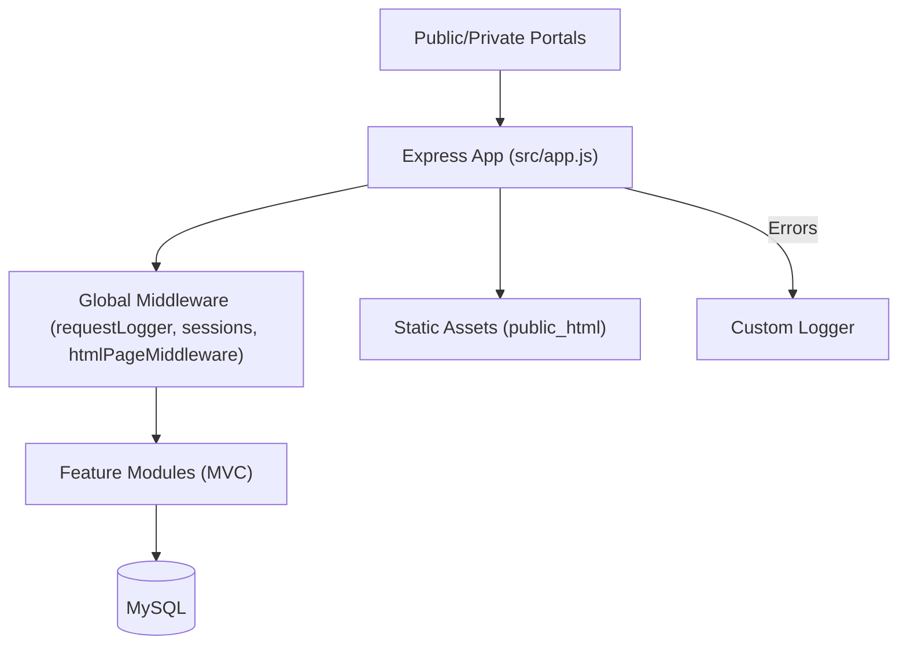

# 14Stars Education Portal
> Unified Node.js portal for managing students, guardians, teachers, substitutes, and academic records across K-8 levels.

## Overview
14Stars Education Portal is an Express-based web application that centralizes enrollment, guardian links, level assignments, and substitute coordination for a private learning center. It exposes JSON APIs consumed by HTML portals in `public_html/` and by internal tools. The backend persists data in MySQL (via `mysql2/promise`) and keeps stateful sessions inside a custom MySQL-backed store.

## Key Features
- **Multi-role Authentication** – Admin, teacher, and parent flows maintain independent session flags (`src/middlewares/authMiddleware.js:1`) and guard private portals or API routes. Passwords are hashed with bcrypt; admins authenticate via environment-provisioned credentials.
- **Student & Guardian Registry** – Admins and parents register learners, deduplicate records, and associate guardians through `student_guardian`. Controllers verify required fields and enforce domain rules (`src/modules/admin/admin.controller.js:22`, `src/modules/parent/parent.controller.js:71`).
- **Academic Structure Management** – Terms, levels, subjects, and teacher-class assignments can be created, updated, or removed through dedicated modules to keep curricular data normalized (`src/modules/term`, `src/modules/level`, `src/modules/subject`, `src/modules/teacher-class`).
- **Grade & Level Tracking** – `student_level` captures per-term subject assignments plus midterm/final/average grades with numeric validation (`src/modules/student-level/student-level.controller.js:16`). Parents can query records filtered by guardian session metadata.
- **Substitute Network & Requests** – Schools manage substitute rosters and collect day-specific substitution requests. Deduplication ensures one request per email/date combination (`src/modules/substitute-request/substitute-request.controller.js:5`).
- **Homepage Announcements** – Admins publish dynamic announcements with optional action links that render on the landing page via the `/announcements` module and admin UI.
- **Operational Observability** – Custom logging writes daily log files with leveled output (`logs/` directory via `src/utils/logger.js`). Request tracing injects `x-request-id` and captures latency metrics (`src/middlewares/requestLogger.js:3`).

## Tech Stack
| Layer | Technology | Notes |
| --- | --- | --- |
| Runtime | Node.js 20+ | ES5-style CommonJS modules |
| Web framework | Express 4.x | Body parsing, routing, sessions |
| Database | MySQL 8.x (mysql2/promise) | Connection pool defined in `src/config/dbConfig.js` |
| Authentication | express-session + bcrypt | Custom MySQL session store (`src/config/sessionStore.js`) |
| Utilities | dotenv, moment, cors, cookie-parser | Additional PG dependency reserved for future use |

## Architecture Overview

- Incoming requests cross logger, body parsers, cookie/session middleware, and HTML helpers before hitting module routers.
- Each module bundles routes, controllers, and models. Models reuse the shared pool and implement CRUD logic.
- Static portals live in `public_html/` and are served extensionless through `htmlPageMiddleware`.

## Quick Start
1. **Clone & install**  
   ```bash
   git clone <repo-url> && cd 14Stars-project
   npm install
   ```
2. **Create `.env`** (see `docs/CONFIGURATION.md` for keys) and ensure MySQL is reachable.
3. **Bootstrap schema**  
   ```bash
   mysql -u <user> -p -h <host> < database < src/config/schema.sql
   ```
4. **Run in development**  
   ```bash
   npm start
   ```
   Visit `http://localhost:30000` (or `PORT`) to load HTML portals or call APIs.

## Database migrations
- Run ad-hoc migrations from `docs/migrations/` when rolling updates onto an existing database. Each file maps to the production notes in this README (teacher accounts, student grades, student-level terms, teacher-class assignments, homepage announcements) and can be executed individually with `mysql -u <user> -p <db> < docs/migrations/00x_*.sql`.

## Screenshots / Demo Placeholders
| View | Placeholder |
| --- | --- |
| Admin dashboard | `` |
| Parent portal | `` |
| Teacher portal | `` |

## Documentation Index
- [Setup & Installation](docs/SETUP_AND_INSTALLATION.md)
- [Architecture](docs/ARCHITECTURE.md)
- [API Reference](docs/API_REFERENCE.md)
- [Feature Deep Dive](docs/FEATURES.md)
- [Configuration](docs/CONFIGURATION.md)
- [Deployment Guide](docs/DEPLOYMENT.md)
- [Security Reference](docs/SECURITY.md)
- [Testing Strategy](docs/TESTING.md)
- [FAQ & Tips](docs/FAQ.md)
