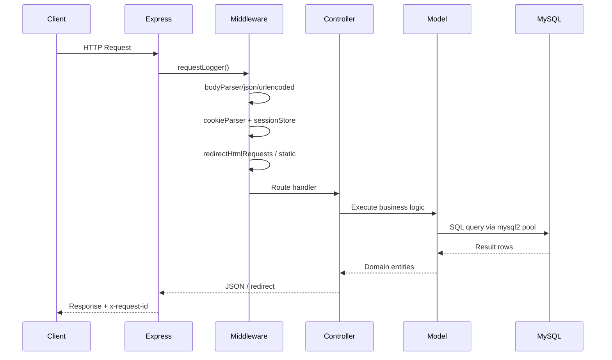
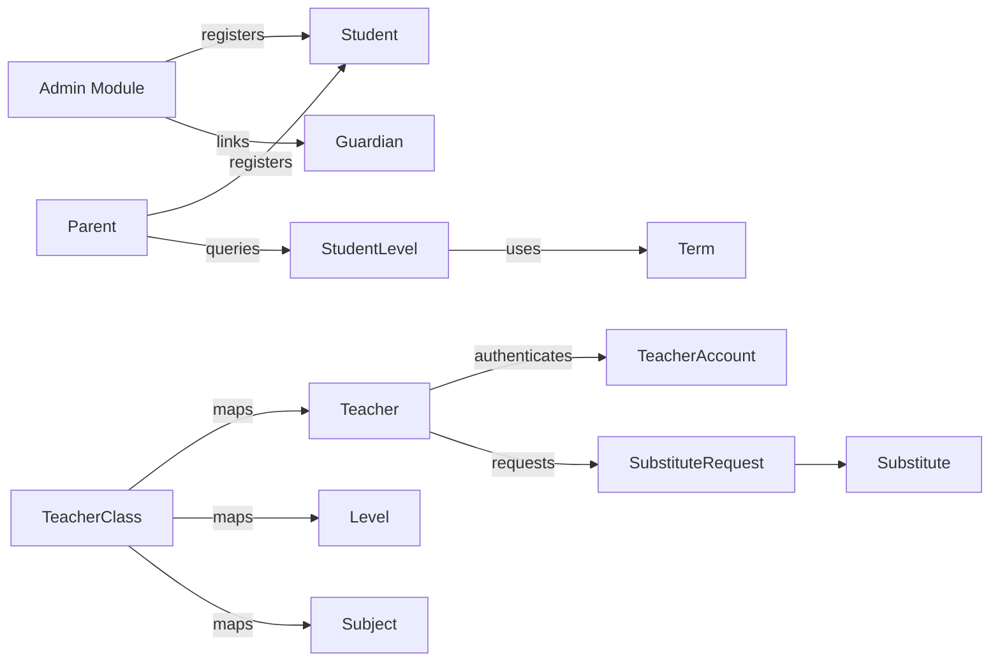

# Architecture

## High-Level Design
The system follows a modular MVC pattern:
- **Express bootstrap (`src/app.js`)** wires middleware, static asset serving, and router registration.
- **Modules per domain** (students, parents, teachers, etc.) each expose `*.routes.js`, `*.controller.js`, `*.model.js`.
- **Shared utilities** (logger, helpers) provide cross-cutting functionality (validation, responses, date logic).
- **MySQL** holds relational tables for people, assignments, and session data.
- **Static portals** in `public_html/` interact with JSON APIs using forms or AJAX.

## Request Lifecycle

## Folder Structure
| Path | Description |
| --- | --- |
| `src/app.js` | Primary server bootstrap and router composition. |
| `src/config/dbConfig.js` | MySQL pool (`mysql2/promise`) configured from `.env`. |
| `src/config/sessionStore.js` | Custom `express-session` store writing to `sessions`. |
| `src/middlewares` | Logging, error handling, authentication, HTML routing helpers. |
| `src/modules/*` | Feature modules following MVC segmentation. |
| `src/utils/logger.js` | Rolling file logger with stdout/stderr mirroring. |
| `public_html` | Static admin/parent/teacher portals delivered without `.html` suffixes. |
| `logs` | Rotated log files named `YYYY-MM-DD.log`. |

## Patterns
- **MVC per module** – Routes call controllers, controllers orchestrate helper/model operations, models interact with DB.
- **Service Helpers** – `src/utils/helpers.js` centralizes validation, sanitized responses, and date logic.
- **Custom Session Store** – Inherits from `express-session.Store` to persist sessions in MySQL with TTL cleanup.
- **Middleware Chain** – Request logging + metrics, HTML path normalization, centralized error handler.
- **Portal Response Adapter** – `helpers.sendPortalResponse` tailors responses to HTML form submissions vs. XHR.

## Module Interactions

- Admin + parent flows both hit `StudentModel` but differ in validation + session requirements.
- Teacher-class assignments enrich parent academic views by joining `teacher_class_assignments` when available.
- Substitute requests leverage `helpers.sendPortalResponse` so HTML modals and API clients receive tailored feedback.
