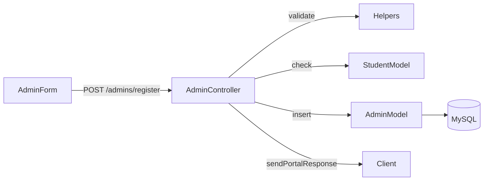
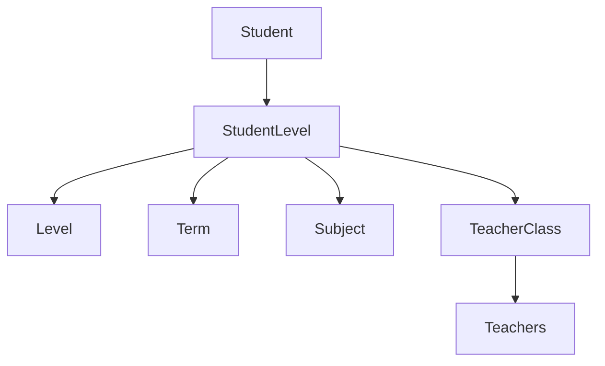

# Feature Deep Dive

## 1. Admin Operations
- **Central Enrollment** – `AdminController.registerStudent` validates required fields, checks duplicates through `StudentModel.doesExist`, and writes to `student`. Successful writes return IDs used elsewhere.
- **Guardian Management** – Admins register guardians, assign relationships, and update/detach them via `student_guardian`, ensuring referential integrity by DB constraints.
- **Student Search** – `getStudByName` supports partial matching with SQL `LIKE` and gracefully handles empty parameters.



## 2. Parent Portal
- **Account Lifecycle** – Parents register accounts stored in `parent_account`, hashed via bcrypt.
- **Student Registration** – Logged-in parents submit student + guardian data; helper sanitizes data, checks duplicates, and links guardians.
- **Academic Dashboards** – `ParentModel.findStudentAcademicRecords` merges `student_level`, `term`, `level`, optional teacher assignments, and gracefully falls back if `teacher_class_assignments` missing.

_Code excerpt (`src/modules/parent/parent.controller.js:106`):_
```js
const studentExists = await Student.doesExist(studentData.fname, studentData.lname, studentData.DOB);
if (studentExists) {
    return res.status(409).json({ success: false, message: 'Student already exists' });
}
```

## 3. Teacher Experience
- **Profile vs Account Separation** – `teachers` table stores demographics; `teacher_accounts` stores credentials referencing teacher email. This prevents orphan accounts and ensures admin approval.
- **Portal Access** – After login, `req.session.isTeacher` gates the HTML portal route and API endpoints.
- **Class Assignments** – Teachers can be mapped to levels + subjects + school years; parents see instructor info in academic history.

## 4. Academic Structuring
- **Levels & Subjects** – CRUD modules maintain catalog tables with unique constraints.
- **Terms** – `term` table stores `term_name` + `school_year`. Student-level assignments require valid term IDs ensuring consistent reporting windows.
- **Grades** – Numeric grades validated via `parseGradeField`; average auto-calculated when possible to reduce manual entry errors.



## 5. Substitute Ecosystem
- **Roster** – Substitute records include contact info for rapid outreach.
- **Request Workflow** – Teachers submit absence requests; deduped by `(teacher_email, date)` and optionally assigned to substitutes via `satisfied_by`.
- **Portal Flexibility** – `helpers.sendPortalResponse` means same endpoints service HTML forms and AJAX clients.

## 6. Session & Middleware Infrastructure
- **MySQL Session Store** – Auto-creates table, handles TTL cleanup, and rotates on process exit. Sessions use rolling expiration to extend active users.
- **HTML Friendly URLs** – `htmlPageMiddleware` strips `.html`, normalizes paths, prevents directory traversal, and serves fallback nested pages.
- **Logging** – `requestLogger` measures latency in ms, attaches request IDs, and warns on aborted responses; `logger` rotates daily log files.

## 7. Observability & Maintenance
- **Structured logging** with metadata enables tracing by session or user agent.
- **Helpers** centralize validation, formatting, and future cross-module utilities, reducing duplicate logic.
