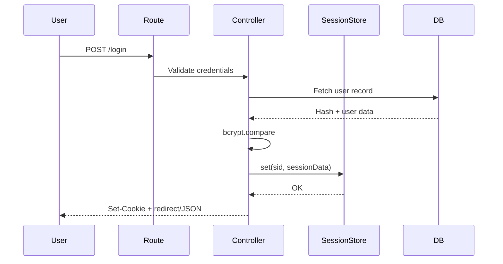

# Security Reference

## Authentication Flow

- Admin login compares against `.env` credentials.
- Teacher/parent logins check hashed passwords in DB; sessions store `isTeacher`, `isParent`, `parentId`, etc.

## Session Handling
- Stored server-side in MySQL `sessions` table via custom store.
- Cookies set `httpOnly`, `sameSite=lax`, `secure` when `NODE_ENV=production`.
- Rolling sessions extend `maxAge` on each request; TTL default 4 hours.

## Rate Limiting
- **Not implemented** natively. Deploy behind a proxy (NGINX, Cloudflare) enforcing rate limits per route (e.g., `/admins/login`, `/parents/login`, `/teachers/teacher-login`) to mitigate brute force.

## Input Validation
- Required field validation via `helpers.validateRequiredFields`.
- Grade parsing enforces numeric range 0–100.
- SQL queries use parameterized statements to prevent injection.
- Additional recommendations: add Joi/Zod schema validation per endpoint for stronger guarantees.

## Common Threats & Mitigations
| Threat | Mitigation |
| --- | --- |
| Credential stuffing | Enforce rate limiting + lockout policies; encourage strong passwords. |
| Session fixation | New sessions created post-auth; ensure session IDs rotate on login. |
| XSS in portals | Serve HTML from trusted templates; sanitize user-entered text before rendering. |
| SQL Injection | All queries use `?` placeholders; avoid string concatenation. |
| CSRF | `sameSite=lax` reduces CSRF risk; consider CSRF tokens for form-heavy portals. |
| Sensitive logging | Logger avoids storing raw passwords; ensure logs reside on protected hosts. |
